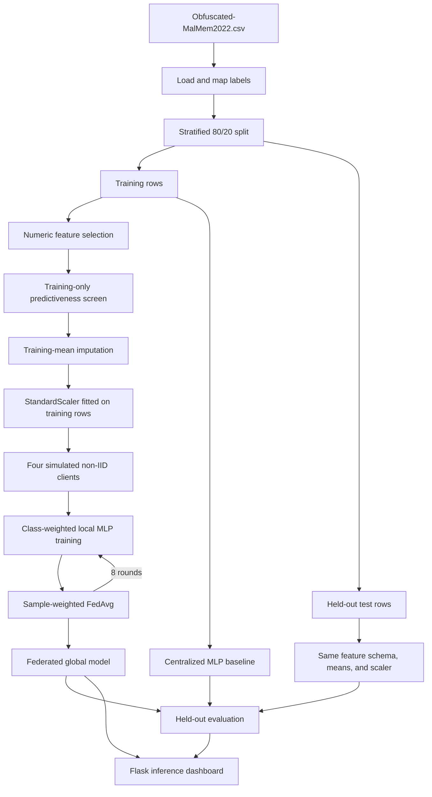

# Architecture and data flow

## End-to-end architecture



## Why the split happens before screening and scaling

The test set represents unseen evaluation data. Any operation that learns from
the distribution must be fitted only on training rows. ThreatSense therefore:

1. splits first;
2. screens features using training rows only;
3. calculates imputation means using training rows only;
4. fits `StandardScaler` using training rows only;
5. applies the saved decisions to test rows.

This reduces test-set contamination. It does not eliminate other possible
forms of dataset bias such as duplicate captures, shared malware families, or
collection-environment artifacts.

## Federated round sequence

For each of eight rounds:

1. The server holds global weights `W_global`.
2. Every client starts from an exact copy of `W_global`.
3. Each client trains for one local epoch on its own partition.
4. Each client returns updated weights and its row count.
5. The server computes the sample-weighted average.
6. The global model is evaluated on the common held-out test set.

The implemented aggregation is:

```text
W_next = sum_k (n_k / sum_j n_j) * W_k
```

where `n_k` is client `k`'s row count and `W_k` is that client's trained weight
list.

## Important simulation boundary

All clients are pandas DataFrames inside one Python process. The code models
the data separation and aggregation algorithm, but there are no remote client
machines, sockets, authentication, transport encryption, failures, or
asynchronous updates.

## Non-IID partition

`partition_non_iid` creates label-ratio skew:

```text
Client target benign ratios: 80%, 60%, 40%, 20%
```

Target sizes differ by at most one row, so the current primary run does not
have meaningful quantity skew. Sample-weighted FedAvg is correct but receives
nearly equal weights in this configuration.

## Centralized baseline flow

The centralized baseline uses:

- the identical seed-42 split;
- the saved 31-feature schema;
- the identical scaler;
- the same MLP architecture;
- eight centralized epochs;
- no federated partition or aggregation.

This isolates the cost of the training arrangement more cleanly than comparing
different model architectures or test rows.

## Inference flow

```text
Browser form or random dataset row
  -> JSON {feature_name: value}
  -> missing features filled with 0 and warned
  -> saved 31-column order
  -> saved StandardScaler.transform
  -> saved federated model.predict
  -> threshold 0.5
  -> Benign or Malware + malware probability
```

The UI reports the label first and explains that the probability always refers
to Malware/class `1`.
